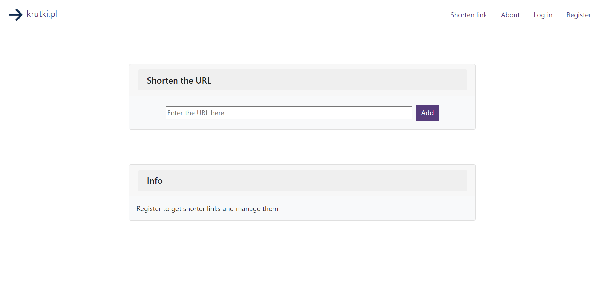
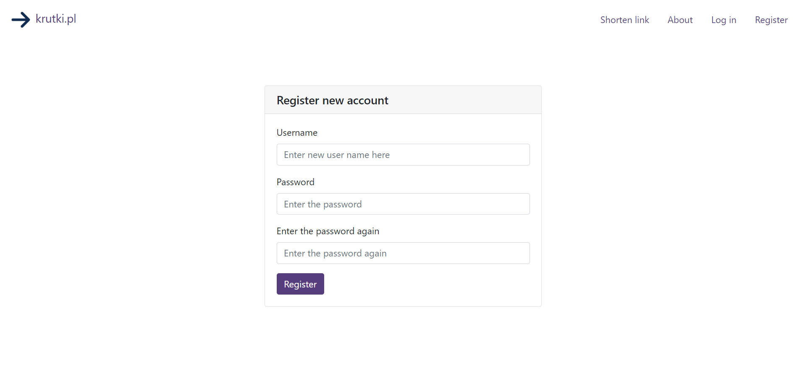
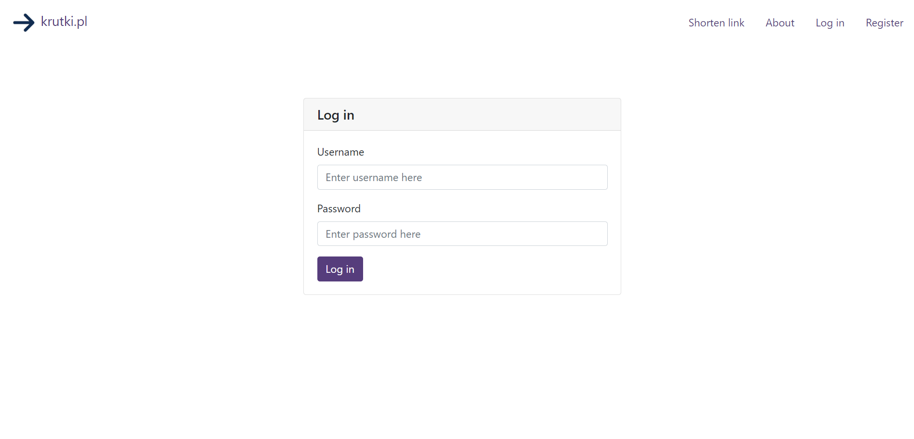
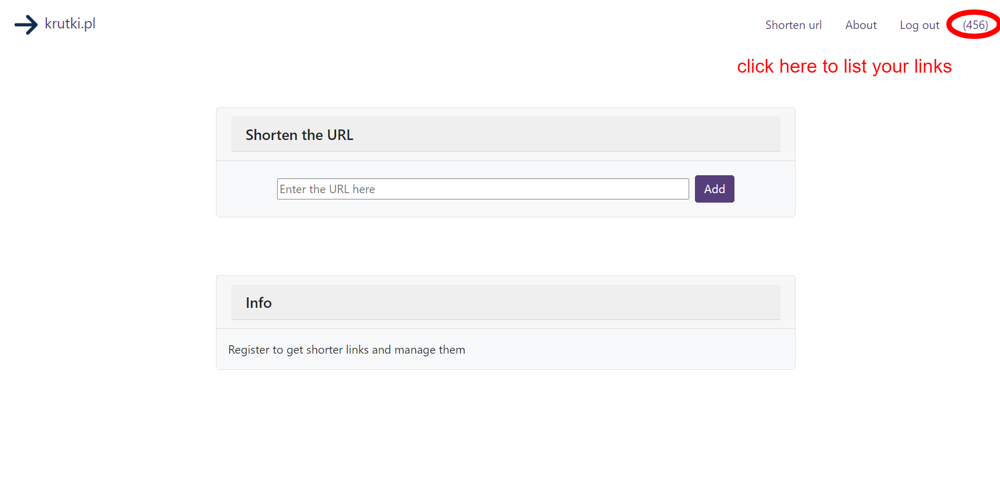
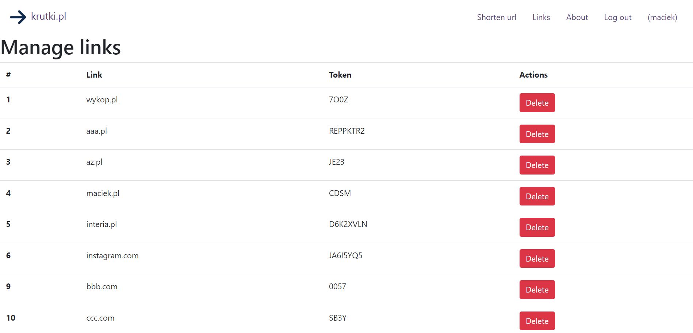
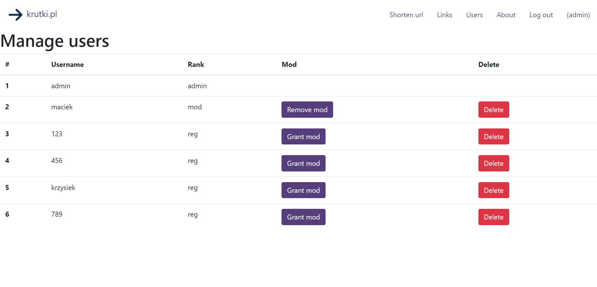

# krutkipl
Link shortener written with Go. Project uses Gin Gonic, Gorm and Sqlite.

Copyright 2023 Tomasz Wnuk

tjwnuk@proton.me

## Features

* shortening long URLs to shorter form
* user registration and authentication
* shorter links for registered users (token has 4 chars instead of 8)
* deleting your own links
* managing links as a moderator or administrator
* managing users, giving or removing mod privileges or deleting users

## Screenshots








## Accounts and database

The page uses Sqlite3 database, due to its simplicity. The data is stored in database.db file.
You can delete it and create new, populating it by your own data. Just delete database.db file and run the server.
Remember to create admin account and manually set its rank to 'admin'

All the accounts in provided database have passwords the same as the account name. For example, user 'admin' has password 'admin', user '123' has password '123' and so on.


## Install

1. Install golang - https://go.dev/doc/install

2. Clone this repo

```git clone git@github.com:tjwnuk/krutkipl.git```

3. Run the server

```go run main.go```

The server will start. Optionally you can build binary

```go build -o krutkipl```

and run it

```./krutkipl```

## License
This code is for educational purposes only. Please do not modify or distribute it.

Copyright 2023 Tomasz Wnuk

Contact: tjwnuk@proton.me

https://github.com/tjwnuk

https://www.linkedin.com/in/tjwnuk/